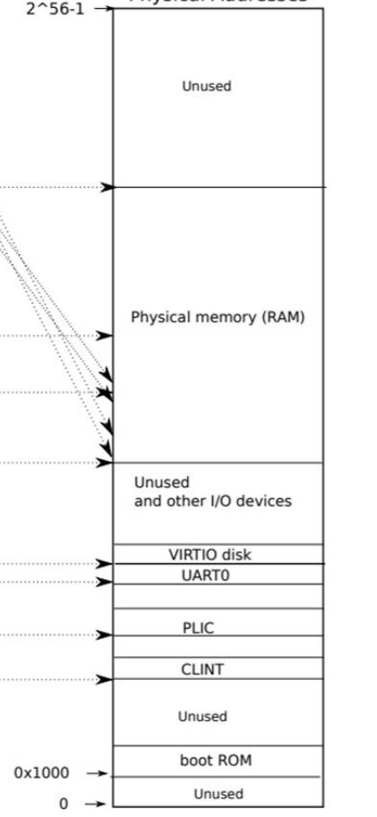

## 引导过程介绍

我们的FarmOS使用OpenSBI作为BIOS引导程序。OpenSBI的主要功能就是在M态初始化硬件，然后以S态跳转到内核的位置，完成整个启动过程。此外，OpenSBI作为S态内核的执行环境（EEI），可以以 `ecall` 的方式为S态内核提供一些只有M态才能实现的功能。

### OpenSBI的引导过程

OpenSBI会先做初始化，然后以 **S 态**跳转到编译时指定的位置（默认为`0x80200000`），并将Hartid、设备树地址分别放在`a0`、`a1`中传递给OS。如下所示：


reference: https://blog.csdn.net/dai_xiangjun/article/details/123524264

运行过程截图：


OpenSBI启动时打印的信息包含当前的核数、设备信息、下一个阶段（内核运行的环境）的状态、启动核信息等。其中最重要的就是启动核号（Boot Hart ID）。OpenSBI并不会以固定的核启动，而是会**随机选择一个核启动**，在我的环境中（Ubuntu 22.04虚拟机），OpenSBI最常以 0核启动，不过也有时会从其他核启动。这就要求内核的boot部分需要屏蔽启动核的差异，无论用什么核都能正常启动。

### 内核链接脚本

`linker/kernel.ld`：用于将内核ELF的各段加载到正确的位置

```lds
OUTPUT_ARCH( "riscv" )
ENTRY( _entry )

SECTIONS
{
  . = 0x80200000;

  .text : {
    *(.text .text.*)
    . = ALIGN(0x1000);
    /* 需要定义一个trampsec: .section trampsec。
      此section是用户态下的中断入口程序，与内核共享，
      需要单独占据一个页的长度(参考trampoline.S)
     */
    _trampoline = .;
    *(trampSec)
    . = ALIGN(0x1000);
    ASSERT(. - _trampoline == 0x1000, "error: trampoline larger than one page");
    . = ALIGN(0x1000);
    PROVIDE(end_text = .);
  }

  .rodata : {
    . = ALIGN(16);
    *(.srodata .srodata.*) /* do not need to distinguish this from .rodata */
    . = ALIGN(16);
    *(.rodata .rodata.*)
  }

  .data : {
    . = ALIGN(16);
    *(.sdata .sdata.*) /* do not need to distinguish this from .data */
    . = ALIGN(16);
    *(.data .data.*)
  }

  .bss : {
    . = ALIGN(16);
    *(.sbss .sbss.*) /* do not need to distinguish this from .bss */
    . = ALIGN(16);
    *(.bss .bss.*)
  }

  . = ALIGN(0x1000);
  PROVIDE(end = .);
}
```

物理内存布局：（摘自xv6-riscv指导书）



我们的内核布局与xv6相近，只不过内核的起始位置为 `0x80200000`。为什么不选择 `0x80000000` 呢？这是因为 `0x80000000` 是OpenSBI放置的位置，将内核加载到此位置会与OpenSBI冲突。xv6是从M态启动的，其启动并不依赖OpenSBI，所以可以加载到`0x80000000` 位置。

在物理内存布局中，`0~0x80000000` 段是设备的MMIO映射区域；`0x80000000~MAXPA` 是物理内存的位置。也就是说，物理内存的第一个字节对应物理地址 `0x80000000`。

在启动阶段，没有开启分页，所以我们可以暂时使用物理地址访问物理内存。等到了虚拟内存初始化阶段，会将物理内存一对一地映射到内核页表，仍然能做到与启动阶段详细的内存访问方式。

### 启动过程

1. 入口点 `_entry` 位于`boot/entry.S` 中。下面的汇编代码根据hartid设置当前cpu对应的栈顶指针，并跳转到start函数。

   ```assembly
   _entry:
           # set up a stack for C.
           # stack0 is declared in start.c,
           # with a 4096-byte stack per CPU.
           # sp = stack0 + ((hartid+1) * 4096)
   
           # status = Supervisor, a0 = hartid, a1 = dtb
           la sp, stack0
   
           li t0, KSTACKSIZE
           mv t1, a0
           addi t1, t1, 1
           mul t0, t0, t1
           add sp, sp, t0
   
           # jump to start() in start.c
           # pass a0 as hartid
           call start
   spin:
           j spin
   ```

2. `start.c` 中，定义了内核栈和 `start` 函数。每个hart可以分到4页的栈空间，这对内核来说足够用了。

   ```c
   void start(long hartid, uint64 _dtb_entry) {
   	// 设置dtb_entry
   	extern uint64 dtbEntry;
   	if (dtbEntry == 0) {
   		dtbEntry = _dtb_entry;
   	}
   
   	// Supervisor: disable paging for now.
   	w_satp(0);
   
   	// enable some supervisor interrupt
   	w_sie(r_sie() | SIE_SEIE | SIE_STIE | SIE_SSIE);
   
   	// 在每个CPU的tp寄存器中保存hartid
   	w_tp(hartid);
   
   	main();
   }
   ```

   `start` 函数的参数来源于openSBI设置的 `a0` 和 `a1`，分别对应hartid和设备树的起始地址。start函数主要作用是记录了设备树的地址，关闭分页，开启S态的外部中断、核内时钟中断和软中断。之后在 `tp` 寄存器中设置hartid。注意，我们之后**始终**要保持内核态下 `tp` 寄存器为 hartid，因此在进入用户态和回到内核态时需要维护这个寄存器的值。

3. `main.c` 中的 `main` 函数主要进行各项初始化工作。对于第一个启动的核，需要依次进行以下工作：

   * 初始化printf（printf使用SBI_PUTCHAR实现）
   * 解析设备树，获得内存大小信息
   * 虚拟内存和物理内存初始化
   * 块缓存初始化
   * **开启分页**
   * 初始化中断处理和核内时钟
   * 初始化中断控制器
   * 使用 `SBI_HART_START` 启动其他核
   * **等待其他核启动完毕**
   * 初始化virtio驱动
   * 初始化根文件系统
   * **开启 `init` 进程**

   要求等待其它核启动完毕之后才能初始化virtio驱动，是考虑到了virtio驱动在读写时会产生中断，而virtio中断会随机分配到一个核上。当收到中断的核处于未启动的M态时，没有配置virtio中断处理程序，会导致virtio初始化失败。所以我们需要在初始化virtio之前保证所有核都已启动。

   虽然说一个核就能完成大部分初始化工作，但因为架构要求，多核还是有一些需要各自初始化的代码。多核环境下需要注意这些事项：

   * 每个核需要设置独立的页表。允许各个核在运行阶段使用不同的页表
   * 每个核有独立的核内时钟，为每个核单独计时
   * 每个核有独立的中断处理向量，我们一般将其设为同一个位置
   * 每个核有独立的外部中断控制器
   * 当一个核与其他核访问同一个变量或同一块内存时，为了缓存能够及时同步，需要加 `fence` 指令，保证之前的所有读写指令在fence之后都已同步到内存。对应gcc的语法为 `__sync_synchronize()`

   下面是其他核初始化阶段完成的功能：

   * **开启分页**
   * 初始化中断处理向量
   * 初始化核内时钟
   * 初始化中断控制器

   至此，启动阶段结束。

### 附录

OpenSBI支持使用下列三种方式编译固件：

1. 带有动态信息的固件(FW_DYNMIC)：

   FW_DYNAMIC固件在运行时从**上一个引导阶段**获取**下一个引导阶段入口**的信息（可以理解为承上启下的作用 (#^.^#) ），下一个引导阶段为：引导加载程序或操作系统内核。

   * 下一个启动阶段(如bootloader)和FW_DYNAMIC被上一个启动阶段加载(如LOADER)

   * 上一个启动阶段(即LOADER)通过 `a2` 寄存器将 `struct fw_dynamic_info` 的位置传递给FW_DYNAMIC

   * 之前的启动阶段(即LOADER)需要知道 `struct fw_dynamic_info`（这个结构体包含下一个阶段的起始地址、特权级状态等）

   

2. 带跳转地址的固件(FW_JUMP)（我们正在用的）

   

   FW_JUMP固件假设下一个引导阶段入口的地址是固定的，例如引导加载程序或操作系统内核，而不直接包含下一个阶段的二进制代码。

   * 下一个启动阶段(bootloader), 上一个启动阶段(LOADER)加载FW_JUMP

   * 这对**QEMU**非常有用，因为我们可以使用预编译的FW_JUMP

   * 上一个启动阶段(即LOADER)必须在一个固定的位置加载下一个启动阶段(即bootloader)

   * 没有机制将参数从之前的启动阶段(即LOADER)传递给FW_JUMP

3. 带负载的固件(FW_PAYLOAD)

   

   FW_PAYLOAD固件直接包含了OpenSBI固件执行后启动阶段的二进制代码。通常，这个有效负载将是一个引导加载程序或一个OS内核。

   1. OpenSBI FW_PAYLOAD可以是任何 S-mode的 bootloader/os 镜像文件。

   2. 允许重写设备树blob(即DTB)

   3. **非常适合sifve unmached板子**

   4. 每当OpenSBI或BOOTLOADER (U-Boot)改变时，我们必须重新创建FW_PAYLOAD映像

   5. 上一个启动阶段(LOADER)不会传递参数给下一个启动阶段
