## 用户进程与调度

本章节主要讲述用户进程的加载过程及进程模块的外部接口。

进程模块的目录结构如下所示：

```txt
include
└── proc
    ├── proc.h
    ├── schedule.h
    ├── sleep.h
    └── wait.h

kern
└── proc
    ├── Makefile
    ├── proc.c
    ├── procInit.c
    ├── schedule.c
    ├── sleep.c
    └── wait.c
```

### 数据结构

进程控制块是管理进程的基本数据结构，其形式如下：

```
struct Proc {
	struct spinlock lock;

	// p->lock must be held when using these:
	enum ProcState state; // 进程状态
	char sleepReason[16]; // 睡眠原因
	/**
	 * 有下面几种情况：
	 * nanosleep：线程睡眠
	 * wait：等待子进程
	 *
	 */
	int killed; // If non-zero, have been killed
	u64 pid; // 进程ID，应当由进程在队列中的位置和累积创建进程排名组成

	// wait_lock must be held when using this:
	u64 parentId; // Parent process
	u64 priority;

	int fdList[MAX_FD_COUNT];

	// these are private to the process, so p->lock need not be held.
	uint64 sz;	  // Size of process memory (bytes)
	Pte *pageTable;	  // User page table
	u64 programBreak; // 用于brk系统调用，以增减该进程的堆空间，进程可以访问任何处于programBreak及以下的内存

	// 实现进程运行时间审计的结构体
	struct ProcTime {
		u64 totalUtime; // 进程运行的总时钟数
		u64 lastTime;	// 进程上一次运行时的时钟数
		u64 totalStime; // 系统时间（可以实现为系统调用花掉的时间）

		u64 procSleepClocks; // 进程要睡眠的周期数
		u64 procSleepBegin;  // 进程开始睡眠的时间
	} procTime;

	// 实现等待机制的结构体
	struct Wait {
		u64 pid;
		u64 uPtr_status; // int *
		int options;
		u8 exitCode; // 进程的退出状态
	} wait;

	// 实现Pipe等待唤醒机制的结构体
	struct PipeWait {
		int i;
		struct Pipe *p;
		int kernFd;
		int count;
		u64 buf;
		int fd;
	} pipeWait;

	struct trapframe *trapframe;  // 进程的Trapframe
	struct Dirent *cwd;	      // 进程当前工作目录
	char name[MAX_PROC_NAME_LEN]; // 进程名称（用于Debug）

	LIST_ENTRY(Proc) procFreeLink;	// 空闲链表链接
	LIST_ENTRY(Proc) procSleepLink; // 进程睡眠链接(进程可以因为多种原因睡眠)
	LIST_ENTRY(Proc) procChildLink; // 子进程列表链接
	TAILQ_ENTRY(Proc) procSchedLink[NCPU]; // cpu调度队列链接
	struct ProcList childList;	       // 子进程列表
};
```

### 用户进程的加载与运行

我们的进程模块参考了北京航空航天大学的教学操作系统MOS（一个基于MIPS的微内核操作系统）。在MIPS CPU中，用户与内核总是位于一个地址空间中：`0~0x7fffffff` 地址是kuseg部分，访存由用户页表控制；`0x80000000~0xafffffff` 是kseg0部分，为内核独享，访存直接以线性关系映射到物理内存。所以可以设置Trap处理程序入口为kseg0部分的地址，这样就可直接访问内核的地址空间。

但是，RISCV64架构中用户与内核使用不同的页表，在 `stvec` 寄存器中设置的中断处理程序地址是**依赖于当前页表**的虚拟地址。借鉴 xv6 的思想，我们使用了Trampoline作为用户态到内核态的跳板。Trampoline这块虚拟内存的特点是所有进程的用户态页表和内核的页表都映射到一个统一的物理地址，所以当发生Trap跳转到虚拟地址Trampoline中执行Trap处理程序时，**切换页表后当前PC的位置对应的物理页面仍然相同**，因此不会因为执行不同的代码而导致问题。



上面是FarmOS一个普通进程的地址空间。进程的代码段从地址0开始，到高地址依次是数据段、堆，堆顶即为program Break，可以使用 `brk` 系统调用为进程拓展或减小虚拟内存。

用户进程**加载运行** (`procCreate`) 的流程如下：

1. 使用 `procAlloc` 分配一个空闲的**进程控制块**。

   1. 设置进程的pid和父亲pid，并初始化该进程的子进程列表为空。

   2. 如果父亲pid不为0，则将该进程加入到其父进程的子进程列表。

   3. 初始化进程的文件描述符表

      * 初始化进程的0、1、2文件描述符为标准输入、标准输出、错误输出

      * 将其他进程描述符标记为空闲

   4. 初始化页表

      1. 为页目录分配一页内存
      2. 映射trampoline
      3. 分配并映射trapframe
      4. 分配并映射映射**进程栈**

   5. 设置进程的工作目录（cwd）

2. 设置进程**运行时信息**

   * 设置优先级，设置进程状态为可运行，设置进程名称

3. 根据ELF二进制数据将用户进程加载到其页表所决定的**虚拟内存**中

4. 寻找一个CPU，将该进程插入到该CPU的运行队列中，使其有机会被调度执行

**从内核态转换到用户态**运行的过程如下（`procRun`）：

1. 设置当前CPU上的下一个进程为将运行的进程
2. 调用 `userTrapReturn` 返回用户态
   1. **关中断**，避免中断对S态到U态转换的干扰
   2. 在 `stvec` 加载用户态的Trap处理入口(trampoline)
   3. 在用户的trapframe中设置内核的一些信息，包括内核页表、Trap处理函数、hartid、内核栈等，以便在用户态发生Trap时在trampoline**恢复内核的上下文**
   4. 在 `sstatus` 设置S态的Previous Mode和Previous Interrupt Enable，以便在 `sret` 时恢复这两个值
   5. 设置 `sepc`，作为进程运行的起始 PC
3. 调用位于trampoline的 `userRet` 回到用户态
   * 设置当前页表为用户进程的页表，**刷新 TLB**
   * 恢复进程的上下文（即寄存器值）
   * `sret` 返回用户态

### 进程模块公共接口

#### 基础状态接口

`proc.c`

* `cpuid` 获取当前的cpuid
* `mycpu` 获取当前的cpu结构体
* `myProc` 获取当前cpu上正在运行的进程

#### 进程管理接口

`procInit.c`

* `procInit` 初始化空闲进程链表和调度进程队列

`proc.c`

* `pidToProcess` 通过进程pid获取进程控制块指针
* `procFork` 产生一个子进程
* `mapFile` 读取一个文件内容到内存，并映射其内容到某个页表所决定的虚拟内存
* `procExec` 实现exec系统调用，以当前进程为载体加载由`path` 指定的另一个程序，并设置其参数为 `argv`，环境变量为 `envp`
* `procCreate` 创建一个进程，并加入调度队列等待调度执行
* `procRun` 在当前CPU上立即运行某个进程（适用于调度或第一个进程的运行）
* `procFree` 回收**僵尸进程**的进程控制块，通常在父进程wait系统调用时使用
* `procDestroy` 结束一个进程，将其变为僵尸进程

#### 调度接口

* `schedule` 采用时间片轮转的调度策略，调度下一个进程到当前CPU上
  * 若 `yield` 参数为 0，则不需要当前进程让出CPU
  * 若 `yield` 参数为 0，则当前进程需要让出CPU，重新选择一个进程调度执行

#### 睡眠接口

我们使用了下列函数来实现 `syscall_nanosleep` 系统调用。这些接口同样可用于其他部分。

* `void sleepProc(struct Proc *proc, u64 clocks)` 使进程陷入定时睡眠，从当前CPU的运行队列中移除，放入到睡眠队列中
* `void wakeupProc()` 在每次时钟中断时调用。检查当前是否有处于NanoSleep状态且可唤醒的进程，如有，则唤醒
* `void naiveSleep(struct Proc *proc, const char *reason)` 简单睡眠函数，需要标明睡眠的进程和睡眠原因，可用于通用的睡眠过程（如等待管道而睡眠）
* `void naiveWakeup(struct Proc *proc)`：简单唤醒函数，将进程从睡眠队列中移除，加入到调度队列

#### 等待接口

* `u64 wait(struct Proc *proc, i64 pid, u64 pStatus, int options)` 等待子进程结束

* `void tryWakeupParentProc(struct Proc *child)` 在进程结束时，尝试唤醒父进程。如果能成功唤醒，就完成父进程未完成的wait系统调用

  > 因为我们没有实现内核线程，所以目前如果进程要睡眠，但唤醒后还需要做额外的工作来完成系统调用，只能由唤醒者完成其剩余的工作
