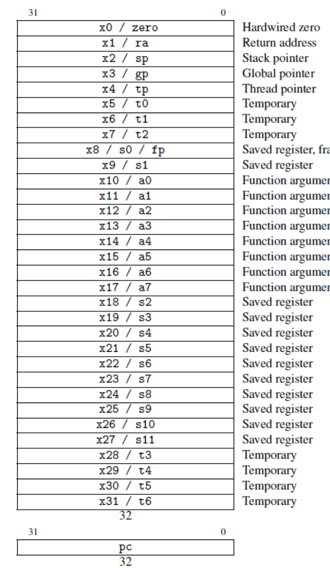
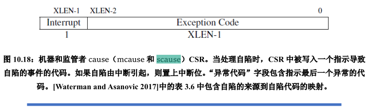
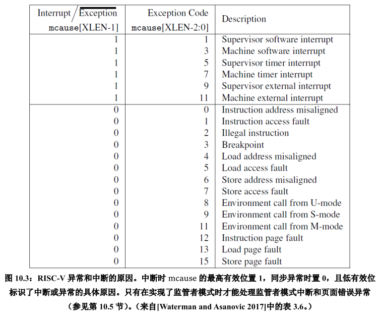
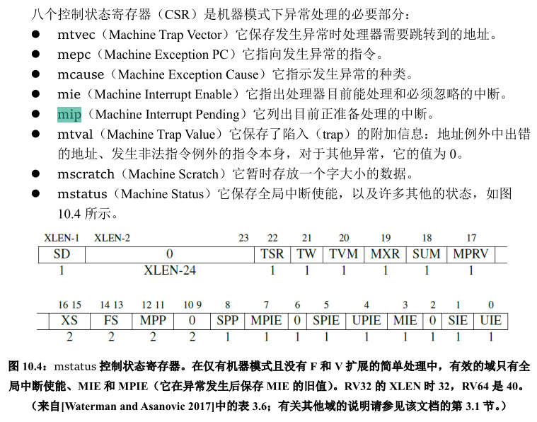
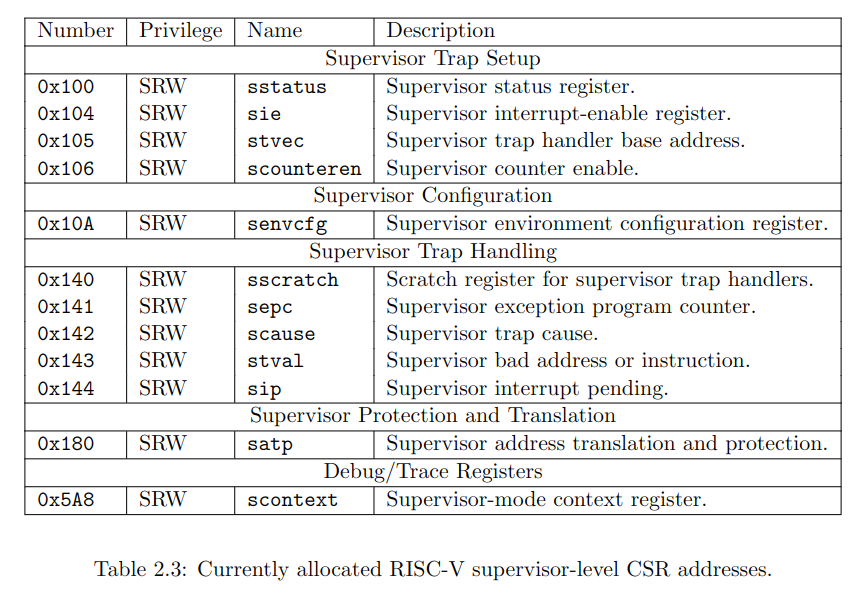
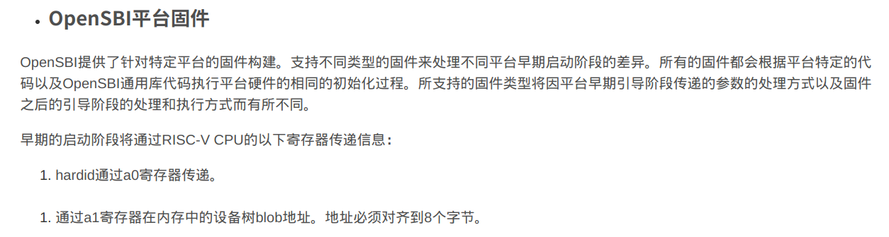
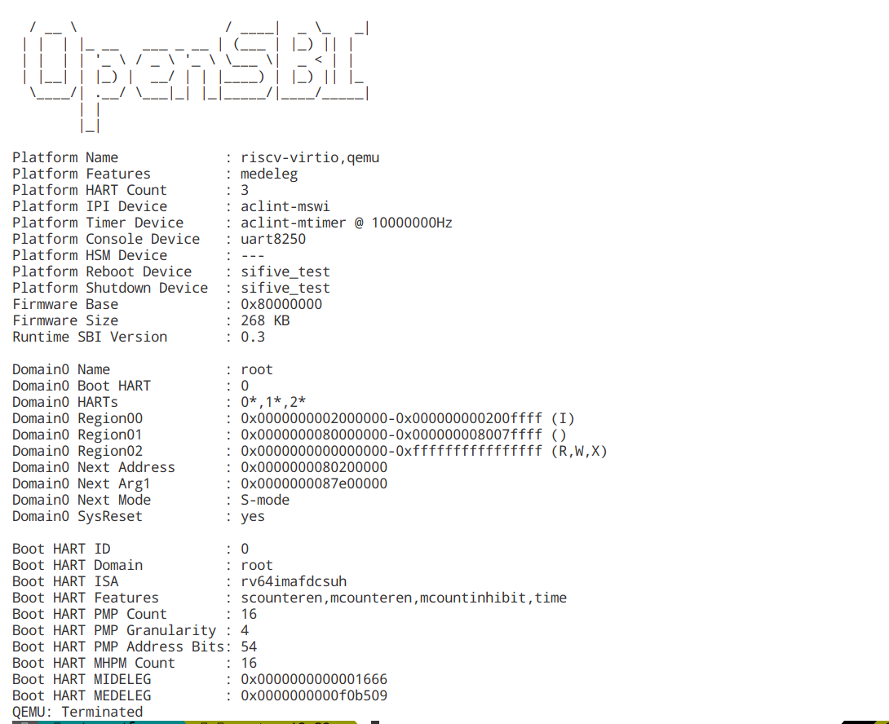
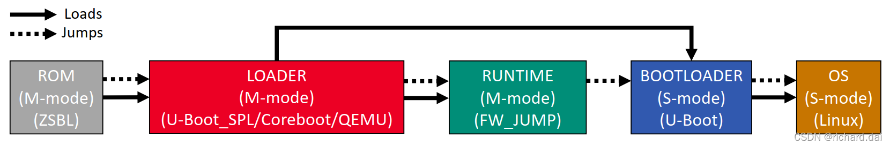
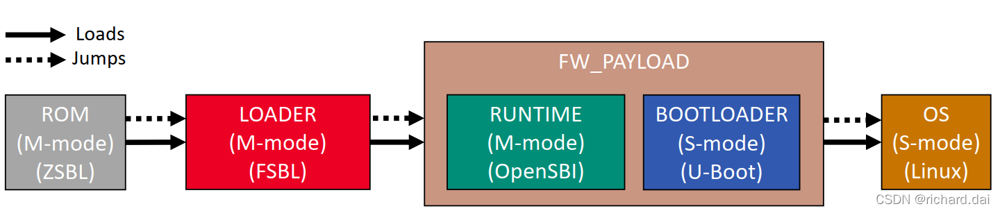

## RISCV64 通用寄存器表



### RISCV特权级寄存器简述

#### 1. scause：发生异常或中断的原因



Exception Code参考表：



#### 2 机器模式下的异常处理寄存器



#### 3 Supervisor模式下的寄存器



### OpenSBI的引导过程

OpenSBI会先做初始化，然后以 **S 态**跳转到编译时指定的位置（默认为`0x80200000`），并将Hartid、设备树地址分别放在`a0`、`a1`中传递给OS。如下所示：



reference: https://blog.csdn.net/dai_xiangjun/article/details/123524264

运行过程截图：



OpenSBI支持使用下列三种方式编译固件：

1. 带有动态信息的固件(FW_DYNMIC)：

   FW_DYNAMIC固件在运行时从**上一个引导阶段**获取**下一个引导阶段入口**的信息（可以理解为承上启下的作用 (#^.^#) ），下一个引导阶段为：引导加载程序或操作系统内核。

   * 下一个启动阶段(如bootloader)和FW_DYNAMIC被上一个启动阶段加载(如LOADER)

   * 上一个启动阶段(即LOADER)通过 `a2` 寄存器将 `struct fw_dynamic_info` 的位置传递给FW_DYNAMIC

   * 之前的启动阶段(即LOADER)需要知道 `struct fw_dynamic_info`（这个结构体包含下一个阶段的起始地址、特权级状态等）

   

2. 带跳转地址的固件(FW_JUMP)（我们正在用的）

   

   FW_JUMP固件假设下一个引导阶段入口的地址是固定的，例如引导加载程序或操作系统内核，而不直接包含下一个阶段的二进制代码。

   * 下一个启动阶段(bootloader), 上一个启动阶段(LOADER)加载FW_JUMP

   * 这对**QEMU**非常有用，因为我们可以使用预编译的FW_JUMP

   * 上一个启动阶段(即LOADER)必须在一个固定的位置加载下一个启动阶段(即bootloader)

   * 没有机制将参数从之前的启动阶段(即LOADER)传递给FW_JUMP

3. 带负载的固件(FW_PAYLOAD)

   

   FW_PAYLOAD固件直接包含了OpenSBI固件执行后启动阶段的二进制代码。通常，这个有效负载将是一个引导加载程序或一个OS内核。

   1. OpenSBI FW_PAYLOAD可以是任何 S-mode的 bootloader/os 镜像文件。

   2. 允许重写设备树blob(即DTB)

   3. **非常适合sifve unmached板子**

   4. 每当OpenSBI或BOOTLOADER (U-Boot)改变时，我们必须重新创建FW_PAYLOAD映像

   5. 上一个启动阶段(LOADER)不会传递参数给下一个启动阶段

## gdb调试

### 0 gdb的启动

```shell
make qemu-gdb
# 此时会显示gdb运行在哪个端口，一般为localhost:26000，接着，开一个新的窗口，运行gdb连接此调试环境
riscv64-elf-gdb <kernel文件> # 用于加载kernel文件中的符号
> target remote localhost:26000
> info registers
```

在任何时候，都可以在gdb中按tab补全命令。

### 1 查看内存值

x \<addr\>: 显示addr处的内存值

x/\[n\]\[format\]\[memory unit size\] \<addr\>：

如

x/4tb 0：以二进制形式展示0处的内存

x/8xw 0：以16进制形式、每四个字节为单位打印内存的内容

x/16cb 0: 以字符形式打印，以字节为单位

x/16s 0：以字符串形式打印内存内容

### 2 反汇编

disassemble 【addr】：反汇编addr处的内存，需要有C语言的栈帧

disassemble 【起始地址】,【结束地址】：**无需C语言栈帧**，适用于OS引导时的debug


`disas $pc,$pc+20`：反编译pc处的汇编代码

### 3 单步执行

汇编级：

采用si单步执行，ni单步跳过

C语言级：

采用s单步执行，n单步跳过

### 4 继续执行

continue

### 5 断点

break [function]

break *\<address\>：支持无C语言栈帧的调试


### 6 显示寄存器

* info registers：显示寄存器的值
* info all-registers：显示所有寄存器的值，包括csr寄存器（S态、M态）
* info reg <某个寄存器的名称，如satp>：显示特定寄存器的值

### 7 以TUI形式显示当前的寄存器位置

layout asm

### 8 C语言的一些注意事项

int: 32bit

long: 64bit

### 9 列出指定函数附近的 C 源码

list main

### 10 多核调试

(1)info threads 可以查看各个核的状态


(2)切换调试的线程：thread 线程id

(3)只运行当前线程：set scheduler-locking on

(4)运行全部的线程：set scheduler-locking off

(5)指定某线程执行某gdb命令：thread apply 线程id gdb_cmd

(6)全部的线程执行某gdb命令：thread apply all gdb_cmd
reference: https://blog.csdn.net/weixin_42158742/article/details/113100151
