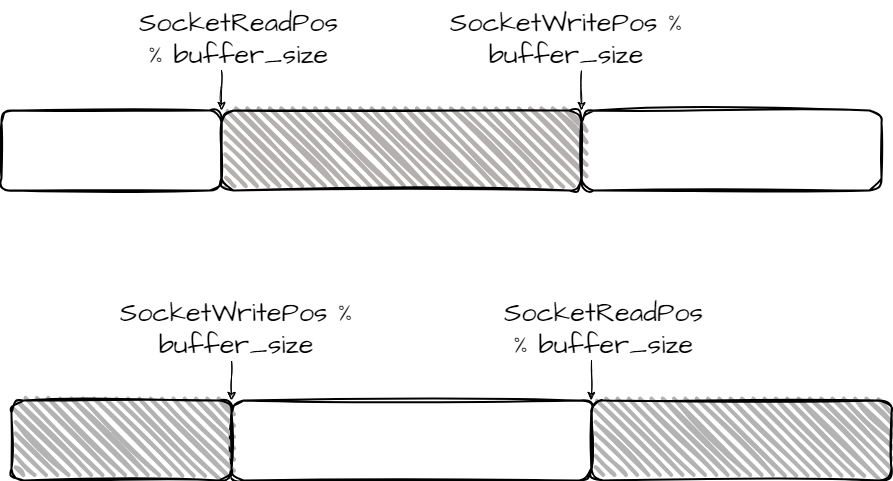

# Socket & Pipe 优化

## Socket优化 

​	在第一阶段的测试中，我们发现TCP、UDP的读写速度均较慢。其中一个原因是我们为每个socket分配了一页大小的缓冲区，但在netperf和iperf的实际测试过程中，我们发现尝试写入内容的大小远大于一页，所以读写socket经常由于缓冲区大小已满而陷入睡眠。

​	在第二阶段，我们将socket的缓冲区大小改为32页。但是，在实际过程中，我们并没有观察到明显的速率优化。所以，为了观察具体的时间开销，我们使用profiling机制计算read、write函数整体以及睡眠、读写数据等各阶段的时间开销。我们发现，read中读取数据所花费的时间较少，但整体所用时间仍较多，推测是read在长时间等待write进程唤醒。在多次阅读write的实现后，我们发现，write函数时间开销的原因在于，我们采用按字节的方式写入缓冲区，主体写入逻辑框架是while的形式，每写入一字节后将会重入while，由于在写入数据前会需要判断对端的状态，所以我们最开始的设计在每一次进行while循环时首先获得自己的状态锁，并在写入一字节后需要重新释放锁，这一冗余的加锁放锁操作极大影响了我们的读写效率。我们还注意到，write函数中每次进入while语句后需要首先需要获得状态锁是因为可能因为无法写入时会陷入睡眠，而睡眠唤醒后，对端的状态可能将改变，所以我们将加锁的逻辑放在了睡眠后，当睡眠唤醒后才再次去申请锁，避免多余加锁、放锁过程。

```c
while (i < n) {
		mtx_lock(&localSocket->state.state_lock); 
		if (localSocket->state.is_close) {
			if (i == 0)	{
				warn("socket write error: target socket is closed.\n");
				mtx_unlock(&localSocket->state.state_lock);
				mtx_unlock(&targetSocket->lock);
				return -EPIPE;
			} else {
				warn("socket writer can\'t write more.\n");
				mtx_unlock(&localSocket->state.state_lock);
				break;
			}
		}
		if (targetSocket->socketWritePos - targetSocket->socketReadPos == PAGE_SIZE) {
			mtx_unlock(&localSocket->state.state_lock);

			wakeup(&targetSocket->socketReadPos);
			sleep(&targetSocket->socketWritePos, &targetSocket->lock,
					"wait another socket to  read.\n");
		} else {
			...
			i++;
		}
}

```


```c
// 修改后 write
while (i < n) {
		if (localSocket->state.is_close) {
			if (i == 0)	{
				warn("socket write error: target socket is closed.\n");
				mtx_unlock(&localSocket->state.state_lock);
				mtx_unlock(&targetSocket->lock);
				return -EPIPE;
			} else {
				warn("socket writer can\'t write more.\n");
				mtx_unlock(&localSocket->state.state_lock);
				break;
			}
		}
    	if (targetSocket->socketWritePos - targetSocket->socketReadPos == PAGE_SIZE) {
			mtx_unlock(&localSocket->state.state_lock);

			wakeup(&targetSocket->socketReadPos);
			sleep(&targetSocket->socketWritePos, &targetSocket->lock,
					"wait another socket to  read.\n");
		} else {
			...
			i += write_length;
            // write_length为最长可写入的长度
		}
		
			
}
```

​	我们对于write函数中写缓冲区的逻辑进行了修改：在获得到自身的状态锁后，尽可能最大程度地读或写，利用memset和memcpy的性能优势。同样，在read也进行了相应的修改，以read函数为例，解释优化原理。如下图所示， 每一次尝读取时，`socketReadPos%buffer_size` 、`socketWritePos%buffer_size`的相对位置有以下两种情况：



​	若`socketReadPos%buffer_size`小于`socketWritePos%buffer_size`，则直接通过`copyOut`读取即可；若`socketReadPos%buffer_size`大于 等于`socketWritePos%buffer_size`，通过两次读取，第一次`copyOut` 缓冲区[socketReadPos%buffer_size, buffer_size]部分的内容， 第二次`copyout` [0, socketWritePos)的内容。

```C
u64 socket_volumn = socket->socketWritePos - socket->socketReadPos; // 实际可读大小
u64 read_volumn = MIN(n, socket_volumn);
u64 read_dst = socket->socketReadPos + read_volumn;


u64 read_begin = localSocket->socketReadPos % SOCKET_BUFFER_SIZE;
u64 read_end = read_dst % SOCKET_BUFFER_SIZE;
if (read_volumn != 0) {
	if (read_begin < read_end) {
		copyOut(buf, localSocket->bufferAddr + read_begin, read_volumn);
	} else {
		copyOut(buf, localSocket->bufferAddr + read_begin, SOCKET_BUFFER_SIZE - read_begin);
		copyOut(buf + SOCKET_BUFFER_SIZE - read_begin, localSocket->bufferAddr, read_end);
	}
}
```

​	完成上述优化后，TCP读写性能优化明显，REVERSE_TCP传输速率达到了约2Gbit/s，其余BASIC_TCP、PARALLEL_TCP的读写速率也均在100Mbit/s以上。

## Pipe优化

​	初期pipe的并发读写参考xv6的设计，这使得在读写pipe缓冲区时，会进行逐字节读写，读写完一字节后，继续判断当前缓冲区是否可写、可读，若不可写、读，则将陷入睡眠状态。在第一阶段的实际测试中，我们发现pipe的性能较低，最快时仅能达到5MB/sec 。 在第二阶段中，我们理清了环形缓冲区的本质，参考socket的优化，尝试每一次尝试最大容量的读、写。

​	以pipe的write为例，我们首先计算出缓冲区剩下大小`left_size`，与系统调用的参数作比较，确定本次可写入的最大长度`write_length`。本次写入的缓冲区起始索引为 `p->pipeWritePos % PIPE_BUF_SIZE`，终止索引为 `p->pipeWritePos % PIPE_BUF_SIZE`。和我们在socket优化时介绍的一致，终止索引和起始索引和大小关系有两种情况，我们会对这两种情况进行分类`copyIn`处理。

```c
while (i < n) {
		if (pipeIsClose(p) || td->td_killed) {
			mtx_unlock(&p->lock);
			warn("writer can\'t write! pipe is closed or process is destoried.\n");
			mtx_lock_sleep(&fd->lock);
			return -EPIPE;
		}
		if (p->pipeWritePos - p->pipeReadPos == PIPE_BUF_SIZE) {
			wakeup(&p->pipeReadPos);
			sleep(&p->pipeWritePos, &p->lock, "pipe writer wait for pipe reader.\n");
		} else {
			u64 left_size = PIPE_BUF_SIZE - (p->pipeWritePos - p->pipeReadPos);
			u64 write_length = MIN(left_size, n);
			u64 write_dst = p->pipeWritePos + write_length;

			u64 write_begin = p->pipeWritePos % PIPE_BUF_SIZE;
			u64 write_end = write_dst % PIPE_BUF_SIZE;

			if (write_begin < write_end) {
				copyIn(buf + i, p->pipeBuf + write_begin, write_length);
			} else {
				copyIn(buf + i, p->pipeBuf + write_begin,  PIPE_BUF_SIZE - write_begin);
				copyIn(buf + i + PIPE_BUF_SIZE - write_begin, p->pipeBuf,  write_end);
			}
			p->pipeWritePos += write_length;
			i += write_length;
		}
}
```

​	经优化后，pipe的读写性能可达到158MB/s，为优化前的30余倍。
