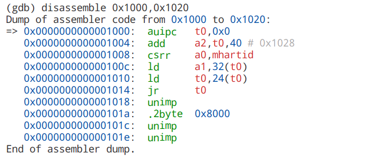
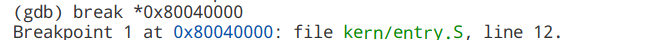
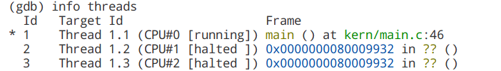

## gdb调试

### 0 gdb的启动

```shell
make qemu-gdb
# 此时会显示gdb运行在哪个端口，一般为localhost:26000，接着，开一个新的窗口，运行gdb连接此调试环境
riscv64-elf-gdb <kernel文件> # 用于加载kernel文件中的符号
> target remote localhost:26000
> info registers
```

在任何时候，都可以在gdb中按tab补全命令。

### 1 查看内存值

x \<addr\>: 显示addr处的内存值

x/\[n\]\[format\]\[memory unit size\] \<addr\>：

如

x/4tb 0：以二进制形式展示0处的内存

x/8xw 0：以16进制形式、每四个字节为单位打印内存的内容

x/16cb 0: 以字符形式打印，以字节为单位

x/16s 0：以字符串形式打印内存内容

### 2 反汇编

disassemble 【addr】：反汇编addr处的内存，需要有C语言的栈帧

disassemble 【起始地址】,【结束地址】：**无需C语言栈帧**，适用于OS引导时的debug



`disas $pc,$pc+20`：反编译pc处的汇编代码

### 3 单步执行

汇编级：

采用si单步执行，ni单步跳过

C语言级：

采用s单步执行，n单步跳过

### 4 继续执行

continue

### 5 断点

break [function]

break *\<address\>：支持无C语言栈帧的调试



### 6 显示寄存器

* info registers：显示寄存器的值
* info all-registers：显示所有寄存器的值，包括csr寄存器（S态、M态）
* info reg <某个寄存器的名称，如satp>：显示特定寄存器的值

### 7 以TUI形式显示当前的寄存器位置

layout asm

### 8 C语言的一些注意事项

int: 32bit

long: 64bit

### 9 列出指定函数附近的 C 源码

list main

### 10 多核调试

(1)info threads 可以查看各个核的状态



(2)切换调试的线程：thread 线程id

(3)只运行当前线程：set scheduler-locking on

(4)运行全部的线程：set scheduler-locking off

(5)指定某线程执行某gdb命令：thread apply 线程id gdb_cmd

(6)全部的线程执行某gdb命令：thread apply all gdb_cmd
reference: https://blog.csdn.net/weixin_42158742/article/details/113100151

### 11 调试用户态程序

在gdb中输入 `symbol-file <用户态二进制文件(例如test_printf.b)>`，即可将symbol切换到用户态。

> reference: https://pdos.csail.mit.edu/6.828/2012/labguide.html

### 12 vscode调试时输入命令

在VSCode下面的调试控制台选项卡，命令框输入 `-exec <要执行的gdb命令>`，即可在线执行命令。

> Execute debugger commands using "-exec <command>", for example "-exec info registers" will list registers in use (when GDB is the debugger).

## 13 VSCode调试时查看寄存器或者变量的值

原本在“调试控制台”下用命令 “-exec x/8x a "可以查看数组内容，那么在监视(watch)窗口下也可以添加"-exec x/8x a", 调试的时候随着单步F10，可以自动执行这个命令（不需要再调试控制台窗口手动执行命令）。查看寄存器值同理，可以输入 `-exec info reg`。

## 14 内存断点

watch *(void/int/char...... *)(内存地址)/全局变量名
为表达式（变量）expr设置一个观察点。一量表达式值有变化时，马上停住程序。
