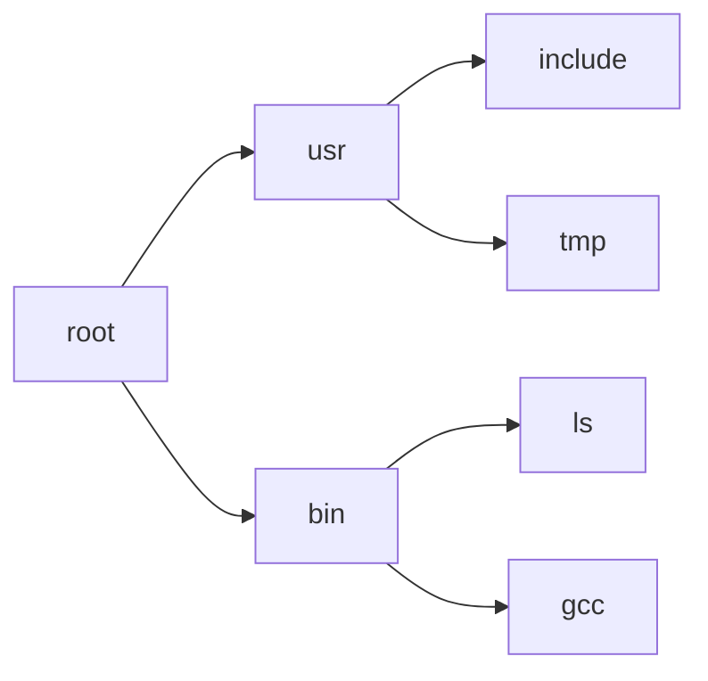
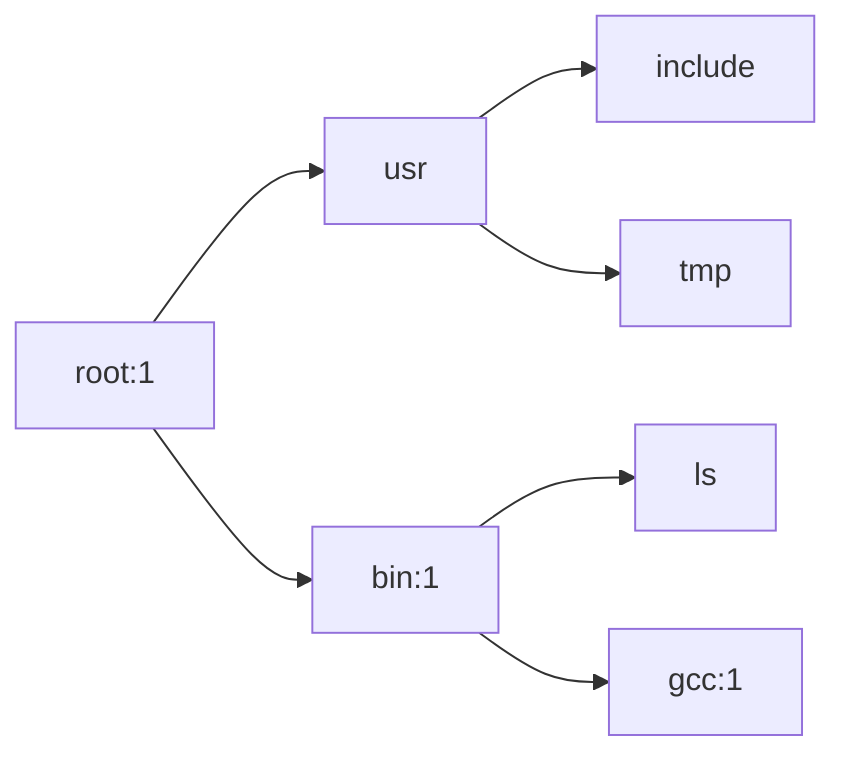

# 文件系统

在国赛第一阶段，我们实现了一个基于接口、支持多核、支持引用计数的文件系统。

## 锁机制
我们的VFS自底向上包含驱动层、buf层、cluster（扇区）层、FAT32文件系统层、文件描述符层这五大层次。

其中，驱动层、buf层、cluster层为了简化操作不加锁，而是由FAT32文件系统层维护一个锁，所有对磁盘文件系统的访问都需要加文件系统锁 `mtx_file`。这个锁保证了文件系统层的各个行为（文件查找、读写、删除等）是互斥的，保证了并发安全。而fd锁则是对kernFd（内核fd）加的锁，父子进程、多个线程因为共享一个kernFd而有可能发生并发访问文件描述符行为，而虽然下层会加锁，但是对fd本身的操作，如增减引用等需要互斥，所以设置了fd层锁 `fd_lock`.

`fd_lock` 和 `mtx_file` 都是睡眠锁。这是因为文件系统下层的操作有可能涉及硬盘读写，需要睡眠。

## 基本读、写、关闭接口封装
在fd（文件描述符）层，我们定义了“文件”的通用接口，包括：

**read**: `int read(int fd, u64 buf, size_t count)`

从 `fd` 读取 `count` 个字节存入到用户态的 `buf`，并移动fd偏移。

如果管道或socket为空且未关闭，则等待直到读取介质的状态变化；

如果管道或socket为空且已关闭，返回0，表示已到结尾；

否则，读取缓冲区内剩余的字符，如果不满count，则读取能读取的所有部分，然后返回。（read最多阻塞一次，允许读不够）

**write**: `int write(int fd, u64 buf, size_t count)`

向 `fd` 写入 `count` 个字节，并移动fd偏移。

如果管道或socket为空且未关闭，则等待直到状态改变；

若管道或socket为空且已经关闭，则返回 `-EPIPE`；

否则持续向管道或socket写入数据，直到数量足够，或者介质满且对端关闭为止；（write可以阻塞多次，如无意外必须写入count字节）

**close**: `int closeFd(int fd)`

释放进程的文件描述符，并将fd的引用计数减一。如归零，则清理fd并调用下层的关闭：

管道或socket：关闭一端，不再收或发数据；

文件：释放文件的引用；

## 基于睡眠的管道机制

### read

读写管道均需要对Pipe结构体这一读写双方共享的缓冲区加锁。睡眠时，需要传入这个锁来临时放锁，因为此时管道已满或者为空，需要对方继续操作完管道才能实现结束的条件，因为放锁让对方持有。

此外，sleep需要位于mtx_lock和mtx_unlock这一对加锁解锁函数之间，因为调用该函数会中途放锁。而wakeup虽然没有特殊必要，但还是建议放在加锁解锁之间。

由于管道分属于父子两个进程，所以在一个进程等待在管道上想要读写数据时，另一个进程需要先close掉一个fd然后才能产生或者消耗数据。这意味着sleep之前要暂时地放掉fd的锁。

但是对管道做的操作都需要加pipe->lock以保证原子性，所以睡眠锁fd->lock的加锁操作不能放到自旋锁pipe->lock加解锁之间。那么，就需要在函数开始时解锁fd->lock，在函数结束之前加锁fd->lock。

```c
mtx_unlock_sleep(&fd->lock);

mtx_lock(&p->lock);
// 如果管道为空，则一直等待
warn("Thread %s: fd_pipe_read pipe %lx, content: %d B\n", cpu_this()->cpu_running->td_name, p, p->pipeWritePos - p->pipeReadPos);
while (p->pipeReadPos == p->pipeWritePos && !pipeIsClose(p) && !td->td_killed) {
	sleep(&p->pipeReadPos, &p->lock, "wait for pipe writer to write");
}

for (i = 0; i < n; i++) {
	if (p->pipeReadPos == p->pipeWritePos) {
		break;
	}
	ch = p->pipeBuf[p->pipeReadPos % PIPE_BUF_SIZE];
	copyOut((buf + i), &ch, 1);
	p->pipeReadPos++;
}

// 唤醒可能在等待的写者
wakeup(&p->pipeWritePos);
mtx_unlock(&p->lock);

mtx_lock_sleep(&fd->lock);
fd->offset += i;
```

### write

写端的逻辑与读端类似，只不过当没有写满时需要一直阻塞到管道写入完毕。

```c
static int fd_pipe_write(struct Fd *fd, u64 buf, u64 n, u64 offset) {
	mtx_unlock_sleep(&fd->lock);
	int i = 0;
	char ch;
	struct Pipe *p = fd->pipe;

	// SIGKILL时，先设置td->killed，再唤醒，之后td才会继续执行，所以td->killed不需要加锁访问
	thread_t *td = cpu_this()->cpu_running;
	mtx_lock(&p->lock);
	warn("Thread %s: fd_pipe_write pipe %lx, content: %d B\n", cpu_this()->cpu_running->td_name, p, p->pipeWritePos - p->pipeReadPos);
	while (i < n) {
		if (pipeIsClose(p) || td->td_killed) {
			mtx_unlock(&p->lock);
			warn("writer can\'t write! pipe is closed or process is destoried.\n");
			mtx_lock_sleep(&fd->lock);
			return -EPIPE;
		}

		if (p->pipeWritePos - p->pipeReadPos == PIPE_BUF_SIZE) {
			wakeup(&p->pipeReadPos);
			sleep(&p->pipeWritePos, &p->lock, "pipe writer wait for pipe reader.\n");
			// 唤醒之后进入下一个while轮次，继续判断管道是否关闭和进程是否结束
			// 我们采取的唤醒策略是：尽可能地接受唤醒信号，但唤醒信号不一定对本睡眠进程有效，唤醒后还需要做额外检查，若不满足条件(管道非空)应当继续睡眠
		} else {
			copyIn((buf + i), &ch, 1);
			p->pipeBuf[p->pipeWritePos % PIPE_BUF_SIZE] = ch;
			p->pipeWritePos++;
			i++;
		}
	}

	// 唤醒读者
	wakeup(&p->pipeReadPos);
	mtx_unlock(&p->lock);

	mtx_lock_sleep(&fd->lock);
	fd->offset += i;
	return i;
}
```

## console的设计

console的写入是无阻塞的。而读取，如下所示，需要阻塞至多一次，获取输入后返回。
console依赖的下层函数是 `cons_getc`，是无阻塞的，如果没有读到字符，将会返回255。此时fd_console_read函数会yield消耗一次时间片，等待下次被调度上cpu时再次检查一下是否有字符。

```c
static int fd_console_read(struct Fd *fd, u64 buf, u64 n, u64 offset) {
	char ch;
	int is_blocked = 0;
	int i;
	for (i = 0; i < n; i++) {
		if (is_blocked) {
			break;
		}

		// 如果没读到字符，cons_getc 会返回255
		while ((ch = cons_getc()) == (char)255) {
			yield();
			is_blocked = 1;
		}
		copyOut((buf + i), &ch, 1);
	}
	fd->offset += i;
	return i;
}
```

## 磁盘文件Dirent树与Dirent引用计数



磁盘文件以 Dirent 数据结构的形式在内存中存储。为了表达Dirent的上下级关系，采用指针维护Dirent的父子关系，最终形成了如上图所示的文件系统Dirent树。查找文件时，只要按树顺序，匹配路径上的每一级文件名，即可找到想要的文件。

在多核环境下，需要加锁，但是加锁只是保证了访问数据结构时的原子性，而不能保证自己持有的数据结构不被销毁。为了保证进程在获取文件到释放文件的整个生命周期内文件都不被释放，我们引入了引用计数机制。

具体而言，当进程调用如下函数时，将会获得文件的引用：

`getFile`：获取一个已存在的文件
`createFile`：创建一个文件

当进程调用 `file_close` 时，将会释放自己之前获得的引用。进程可以持有一个文件的多个引用，这是因为进程可以有多个描述符指向同一个文件，也可以持有文件夹的子文件进而持有父级文件夹的多次引用。

特别地，`makeDirAt` 不获取引用。

`remove` 和 `move` 操作会检查文件的引用是否为0，如果为0，则删除文件，否则返回文件已占用的信息。特别地，当现在引用计数为0但是只有当前进程持有该文件的引用时，暂时不删除文件，而是给文件加一个删除标记，待文件引用计数归零时才删除。这一操作虽与Linux的inode机制有所区别，但也实现了正确的删除行为和删除后持有文件所有权的行为，与libc创建临时文件的机制兼容。

我们规定，当一个文件被获取时，需要同时获取它及它的所有祖先目录的引用。这是因为如果只加自己的引用，那么如果要删除一个目录时，就要循环检查自己的所有子文件，效率很低。我们借鉴了数据库意向锁的机制，即获取上层的所有结构的引用。这样删除文件夹时就只需要检查自己的引用是否为0即可。（如图是获取gcc时的场景）



## 进程文件系统资源的管理

进程的如下三种行为与fs关联：

**进程创建**：除了设置进程的0、1、2号文件描述符为控制台外，初始化进程的其余所有文件描述符为空，并设置cwd信息。

**进程fork**：将父进程的fd引用复制一份给子进程，并将cwd信息也传递给子进程。

**进程结束**：将进程持有的所有**未关闭**的fd关闭掉。

## buf层写回

为了最大程度地加快磁盘IO的速度，我们设置了buf层，用于缓冲磁盘的扇区。

进程对磁盘做读取操作时，内核会先将磁盘扇区内容缓存到内存，然后从缓存中读取；

当做写回操作时，内核会先寻找buf层有无已缓存的扇区，如果有，直接在其中写入，否则读取到buf层后再写入。

磁盘的写回仅会在下面两种情况下发生：

- 分配新的buf时，找到最远未被使用的一块缓存，如果被写入过，就将其写回
- 进程调用`syncfs`同步文件系统时

## IO多路复用：pselect

`pselect` 用于检查给定的一系列fd是否可以读、写或发生异常，如果集合中有fd发生了指定的行为，就立刻返回，否则等待至多timeout后结束。

这样设计的目的是实现IO多路复用。由于管道和Socket就绪的时刻是不确定的，依赖于对端，一旦调用read或write，就会阻塞，不能继续监测其他fd，浪费了进程资源。实现了pselect后，进程可以先调用pselect找到就绪的fd，然后read或write，有效地避免了无意义的阻塞。

对于磁盘文件、管道、Socket，检查时的就绪条件如下所示：

| 操作 | 磁盘文件 |  管道 | Socket |
| ---- | ---- | ---- | ---- |
| 读取  | 总是就绪 | 管道中有数据，或管道关闭 | 接收缓存有数据，或对端关闭 |
| 写入  | 总是就绪 | 管道不为满，或管道关闭 | 发送缓存未满，或对端关闭 |
| 异常 | / | / | / |
